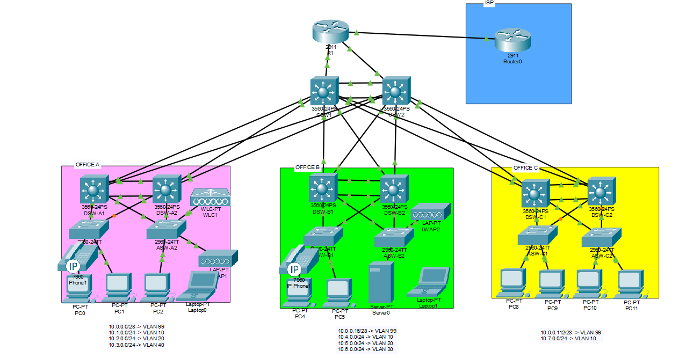

# 🏢 Campus Network — Empresa com 3 Edifícios

Projeto de rede empresarial simulado no **Cisco Packet Tracer**, desenvolvido para estudo de redes e para portefólio.

## 🌐 Network Topology

## 📌 Descrição

Simulação de uma infraestrutura de rede corporativa distribuída por **3 edifícios**, seguindo o modelo hierárquico de rede em **três camadas**:

- **Core Layer** — backbone de alta velocidade, interligando os edifícios
- **Distribution Layer** — agregação de tráfego, routing entre VLANs, redundância
- **Access Layer** — ligação dos dispositivos finais (portas de acesso)

## ⚙️ Tecnologias e Protocolos Implementados

| Categoria | Tecnologia |
|---|---|
| Segmentação de rede | VLANs |
| Redundância de camada 2 | STP (Spanning Tree Protocol) |
| Routing | OSPF (Open Shortest Path First) |
| Redundância de gateway | HSRP em SVIs |
| Agregação de links | EtherChannel |
| Ligação entre switches | Trunk Ports |
| Ligação a dispositivos finais | Access Ports |
| Atribuição de IP | DHCP |
| Tradução de endereços | NAT (Network Address Translation) |
| Segurança e filtragem de tráfego | ACLs (Access Control Lists) |

## 🗂️ Estrutura da Rede

- 3 edifícios interligados via camada Core
- Cada edifício com a sua própria segmentação por VLANs
- Redundância de links entre switches (STP) e entre gateways (FHRP)
- Ligações agregadas (EtherChannel) para maior largura de banda e tolerância a falhas
- Atribuição dinâmica de endereços IP via DHCP
- NAT para tradução de endereços privados para acesso à internet
- ACLs para controlo e filtragem de tráfego entre segmentos de rede

## 🎯 Objetivo do Projeto

Projeto desenvolvido como exercício prático de Campus Network Design, aplicando conceitos de arquitetura hierárquica, routing, switching, redundância, segmentação e segurança de redes.

## 🛠️ Como abrir o projeto

1. Instalar o [Cisco Packet Tracer](https://www.netacad.com/courses/packet-tracer) (gratuito, requer conta NetAcad)
2. Abrir o ficheiro `.pkt` incluído neste repositório

## 📁 Ficheiros

- `Projeto 1 - Empresa com 3 edificios (Campus Network).pkt` — ficheiro do projeto Packet Tracer

---

*Projeto desenvolvido para fins de estudo e portefólio profissional.*
